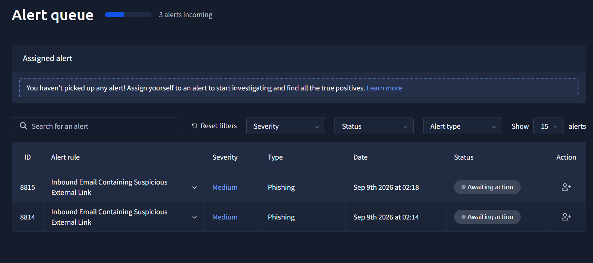
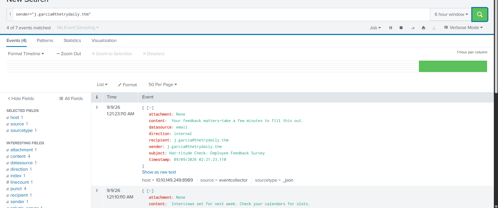
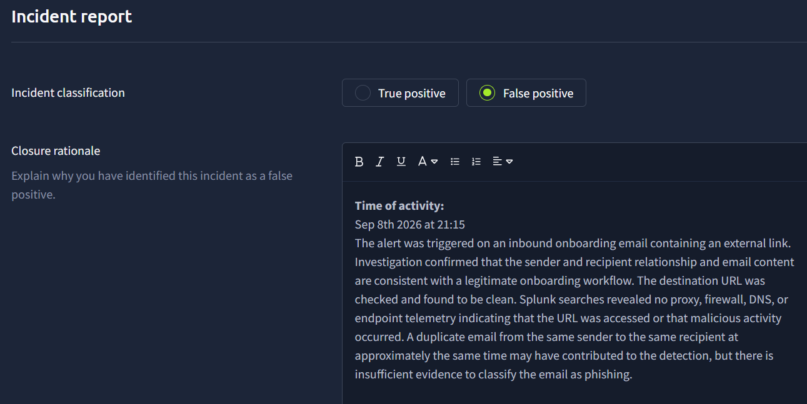
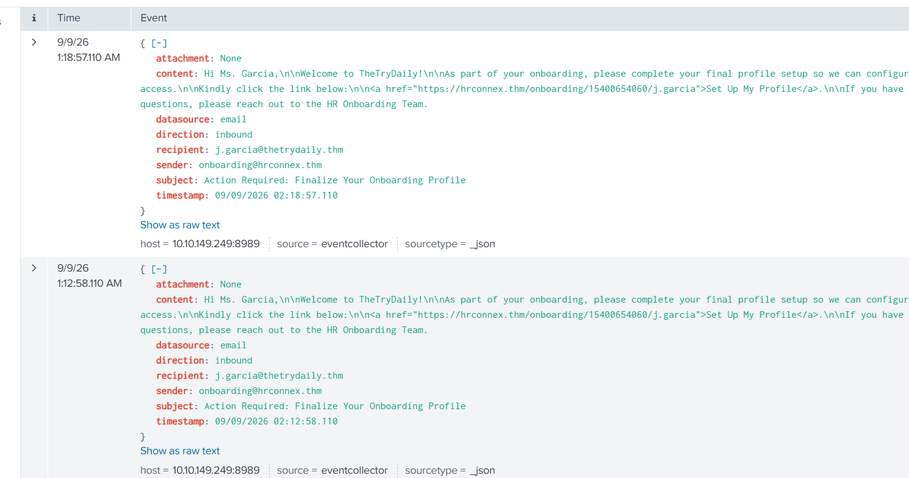
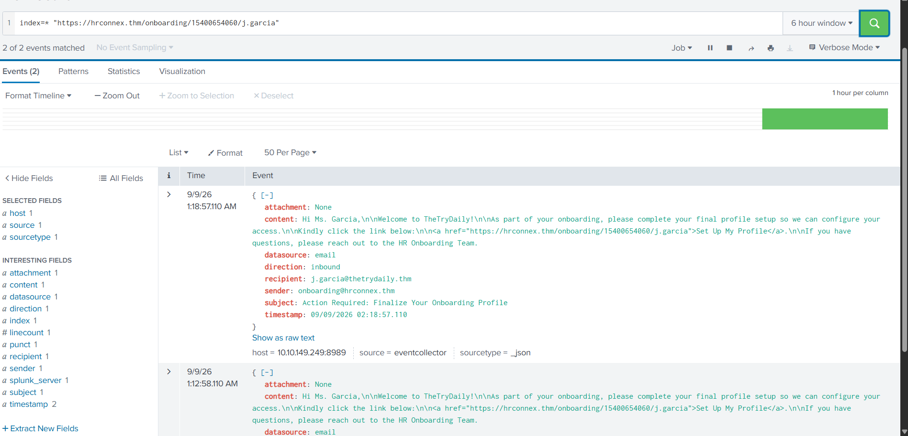
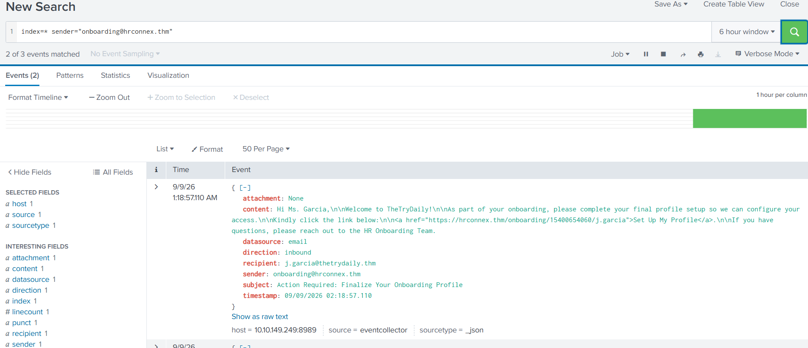
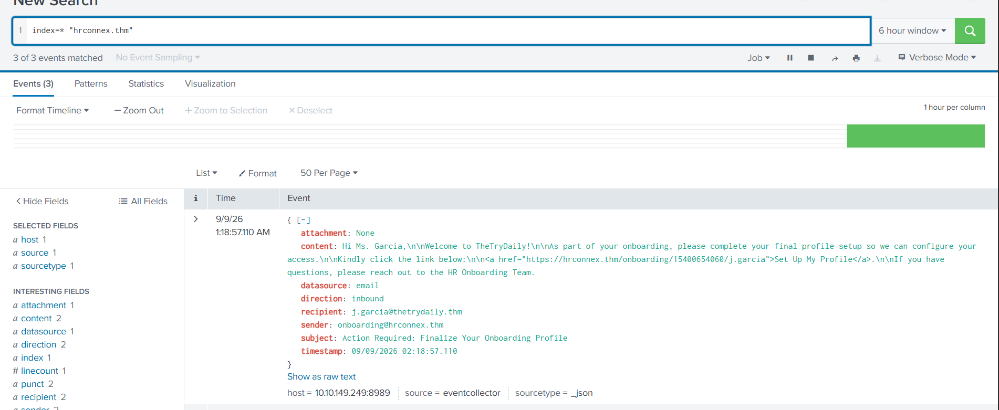
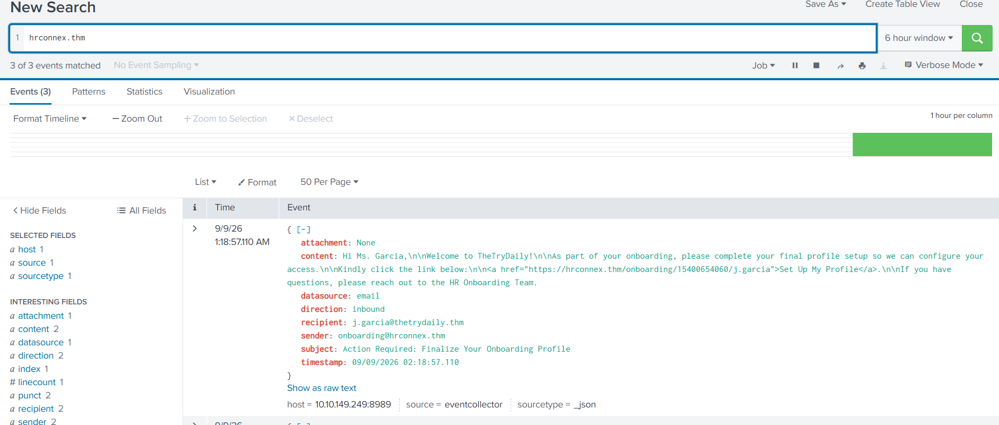
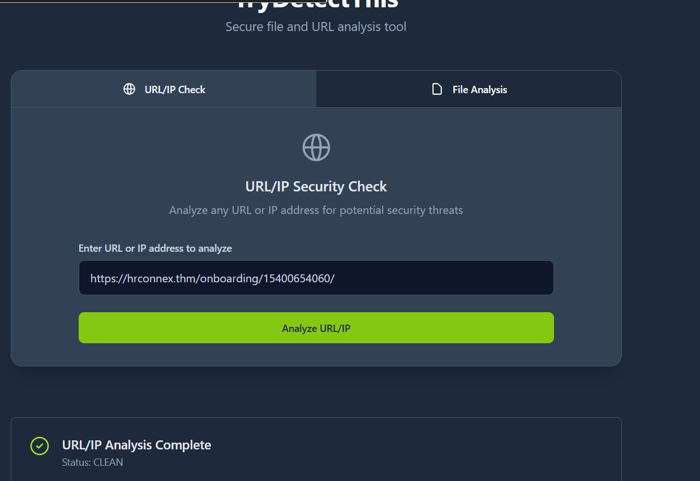
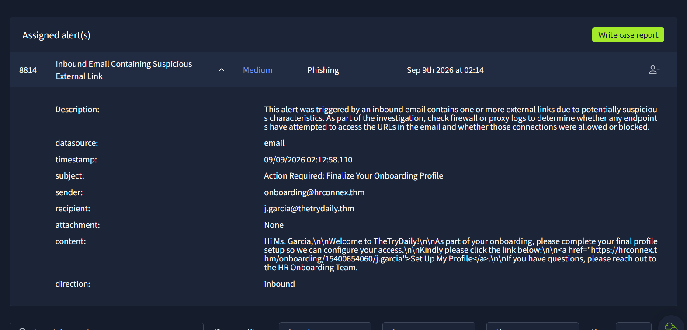

# Phishing Alert Investigation

## Overview

This writeup documents the investigation of a phishing alert generated during a controlled phishing simulation.

The purpose of the investigation was to determine why the alert was generated, identify the activity associated with the alert, and determine whether there was evidence that the targeted user interacted with the phishing email or its embedded link.

The investigation was performed in a controlled lab environment using Splunk as the primary source of security telemetry.

The investigation focused on distinguishing between three separate stages of a potential phishing attack:

```text
Phishing Email
      |
      v
Email Delivery
      |
      v
User Interaction
      |
      v
URL Access
      |
      v
Potential Compromise
```

The presence of a phishing email does not by itself demonstrate that a user interacted with the message or that a compromise occurred.

**Investigation Type:** Phishing Alert Triage
**Environment:** Controlled Phishing Simulation
**SIEM:** Splunk
**Final Assessment:** Likely False Positive
**Confidence:** Moderate

---

# 1. Investigation Objective

The initial alert indicated potentially malicious phishing activity involving an email sent to a recipient within the simulated environment.

The primary objectives of the investigation were to:

* Identify the email associated with the alert.
* Determine when the email was sent and delivered.
* Identify the sender and recipient.
* Determine whether the recipient interacted with the email.
* Search for evidence that the embedded link was clicked.
* Identify activity occurring after the email was delivered.
* Determine why the alert was generated.
* Determine whether the alert represented a legitimate security event or a false positive.
* Document limitations in the available telemetry.
* Identify additional telemetry that could improve confidence in the investigation.

An important distinction throughout the investigation was made between **email delivery**, **user interaction**, and **successful compromise**.

A phishing email appearing in a user's mailbox confirms that the email reached the environment, but it does not establish that the recipient opened the message, clicked the embedded URL, entered credentials, or became compromised.

---

# 2. Initial Alert

The investigation began after a phishing-related alert appeared in Splunk.

The alert contained information relating to a suspicious email and the sender and recipient associated with the event.

## Initial Alert Information

| Field            | Value          |
| ---------------- | -------------- |
| Alert            | `[ALERT NAME]` |
| Severity         | `[SEVERITY]`   |
| Timestamp        | `[TIMESTAMP]`  |
| Sender           | `[REDACTED]`   |
| Recipient        | `[REDACTED]`   |
| Subject          | `[REDACTED]`   |
| Detection Source | Splunk         |

## Initial Triage

At the beginning of the investigation, the alert was treated as a potentially legitimate phishing event.

No assumption was made that the recipient had clicked the embedded link.

The alert was therefore broken down into several investigation questions:

1. Was the suspicious email actually delivered?
2. Were there additional email events associated with the alert?
3. Did the recipient interact with the embedded URL?
4. Was there network activity associated with the URL?
5. Was there evidence of compromise following delivery?
6. What condition caused the SIEM detection to fire?

This approach allowed the investigation to distinguish between confirmed activity and activity that was only suspected.



---

# 3. Initial Hypothesis

Based on the alert, the initial hypothesis was that a phishing email had been delivered to the recipient and that the recipient may have interacted with the malicious link.

The potential attack chain was considered to be:

```text
Phishing Email
      |
      v
Email Delivery
      |
      v
User Interaction
      |
      v
Link Click
      |
      v
Potential Follow-on Activity
      |
      v
Potential Compromise
```

The investigation was intended to determine which portions of this attack chain could actually be supported by available telemetry.

The investigation therefore did not treat the alert itself as proof that the entire attack chain occurred.

---

# 4. Analyst Actions

The investigation was conducted using a series of progressively more targeted searches.

The general investigation workflow was:

1. Review the original alert.
2. Identify the sender and recipient.
3. Search for associated email events.
4. Correlate events around the alert timestamp.
5. Identify potentially duplicate or repeated email activity.
6. Extract the URL contained within the message.
7. Search available telemetry for evidence of URL interaction.
8. Check the reputation of the URL.
9. Search for post-delivery activity.
10. Assess whether compromise could be established.
11. Evaluate possible reasons for the alert.
12. Document limitations and recommended follow-up investigations.

This approach follows a basic SOC principle: **an alert is a starting point for investigation rather than a conclusion.**

---

# 5. Email Event Investigation

The first stage of the investigation focused on identifying the email events associated with the alert.

## Investigation Question

**Was the suspicious email actually delivered to the intended recipient?**

## Splunk Search

```spl
recipient="j.garcia@thetrydaily.thm"
sender="onboarding@hrconnex.thm"
```

## Purpose

The purpose of this search was to locate email events associated with the sender and recipient identified in the original alert.

The search also provided a baseline for examining additional events occurring around the alert timestamp.

Starting with the email telemetry was important because it established the initial event from which the remainder of the investigation timeline could be constructed.

## Findings

The search identified email activity involving the same sender and recipient associated with the alert.

During the investigation, two email events were observed involving the same sender and recipient at approximately the same time.

This was notable because repeated or duplicate events can sometimes contribute to a detection being triggered, depending on how the underlying correlation rule is configured.

However, the investigation did not establish that the duplicate events were definitively responsible for the alert.

Determining that would require reviewing the detection or correlation search responsible for generating the alert.

## Interpretation

The email activity itself was confirmed.

However, this finding only establishes that phishing-related email activity occurred. It does not establish that the recipient interacted with the message.



---

# 6. Investigating for User Interaction

After confirming the email activity, the next investigation question was whether there was evidence that the recipient interacted with the phishing message.

A user interaction could potentially include:

* Opening the email.
* Clicking an embedded URL.
* Navigating to the phishing domain.
* Submitting information to the phishing site.
* Generating network traffic associated with the destination.

The available Splunk telemetry did not contain a direct email-open event that could be used to establish user interaction.

Because of this limitation, the investigation focused primarily on identifying evidence of URL access.

---

# 7. Investigating for Link Interaction

## Investigation Question

**Did the recipient access the URL contained within the phishing email?**

## Splunk Searches

```spl
index=* "hrconnex.thm" action=allowed
```

```spl
index=* "hrconnex.thm" action=blocked
```

```spl
index=* "https://hrconnex.thm/onboarding/15400654060/j.garcia"
```

## Investigation Approach

The investigation searched the available telemetry for events that could indicate interaction with the phishing URL.

Depending on the available data sources, evidence of a link click could include:

* Web proxy requests.
* HTTP/HTTPS connections.
* DNS queries.
* Firewall connections.
* Browser activity.
* Endpoint telemetry.
* URL-click tracking events.
* Network connections to the phishing destination.
* Authentication activity following access to the destination.

A particularly useful indicator would be a web or proxy event showing the recipient's workstation requesting the specific phishing URL.

This would provide stronger evidence of user interaction than simply observing the email itself.

## Findings

No event was identified within the available telemetry that directly demonstrated that the recipient clicked the phishing link.

The available Splunk data primarily contained email-related events.

As a result, the investigation could confirm the presence of the phishing email but could not confirm successful interaction with the embedded URL.

The appropriate conclusion is therefore:

> **No evidence of link interaction was identified within the available telemetry.**

This does not prove that the link was never clicked.

It only establishes that the available telemetry did not provide evidence demonstrating that the click occurred.

---

# 8. What Would Prove a Link Click?

One of the important lessons from this investigation is that different pieces of telemetry provide different levels of confidence.

| Evidence                                                 | Confidence   |
| -------------------------------------------------------- | ------------ |
| Phishing email delivered                                 | Low          |
| Email opened                                             | Low–Moderate |
| DNS query for phishing domain                            | Moderate     |
| HTTP/HTTPS request to phishing URL                       | High         |
| Proxy request from user's workstation                    | High         |
| Browser telemetry showing URL access                     | High         |
| Credential submission to phishing site                   | Very High    |
| Suspicious authentication following phishing interaction | High         |

A DNS query by itself would not necessarily prove that the user clicked the link because DNS requests can be generated by applications, security tools, browsers, or automated processes.

Similarly, an HTTP request would be stronger evidence, but the source system would need to be correlated with the recipient's workstation before attributing the request directly to the user.

The strongest evidence would come from correlating the email recipient with endpoint, browser, proxy, and identity telemetry.

---

# 9. URL Reputation Investigation

The URL contained within the phishing email was submitted to a URL reputation service as an additional source of evidence.

## Finding

The URL was not identified as malicious by the reputation service at the time it was checked.

## Interpretation

This result reduced the amount of evidence supporting malicious activity associated with the URL, but it was not treated as proof that the URL was safe.

URL reputation services can have incomplete visibility into:

* Newly created domains.
* Newly registered infrastructure.
* Short-lived phishing campaigns.
* Previously unknown URLs.
* URLs that become malicious after the initial reputation check.

Therefore, URL reputation was treated as one piece of evidence rather than the determining factor in the final classification.

The clean reputation result should not independently be used to dismiss the original alert.

---

# 10. Event Correlation

The next step was to correlate events surrounding the alert.

The investigation showed that the sender appeared to have sent two emails to the same recipient at approximately the same timestamp.

This raised the possibility that the detection was triggered by multiple related email events rather than evidence of successful phishing interaction.

## Observed Activity

```text
Sender
  |
  +---- Email Event #1 ----> Recipient
  |
  +---- Email Event #2 ----> Recipient
                |
                +---- Approximately same timestamp
```

The repeated email events were therefore treated as an important piece of evidence.

However, the investigation did not establish that duplicate email events were definitively responsible for the alert.

That conclusion would require examining the detection rule or correlation search responsible for generating the alert.

---

# 11. Alternative Explanations

Several possible explanations for the alert were considered.

## Scenario 1 — The recipient clicked the link

This remains possible because the available telemetry was incomplete.

However, no supporting URL, proxy, browser, or endpoint telemetry was identified.

Therefore, there is currently insufficient evidence to support this scenario.

## Scenario 2 — Automated security tooling accessed the URL

Security tools can sometimes automatically inspect links contained in email messages.

If such tooling were present in the environment, a network request could potentially occur without the recipient manually clicking the URL.

This is another reason why network activity should be correlated with endpoint and user activity before concluding that a user interacted with the phishing message.

## Scenario 3 — Duplicate email events contributed to the alert

Two matching email events involving the same sender and recipient were observed around the same time.

This provides a plausible explanation for the alert, although the detection logic would need to be reviewed before this could be considered the confirmed root cause.

## Scenario 4 — The email matched the detection's phishing criteria

The alert may have been generated simply because the email matched one or more conditions within the detection rule.

Without reviewing the underlying correlation search, this possibility cannot be ruled out.

---

# 12. Detection Rule / Root Cause Analysis

A complete investigation should ideally determine not only **what happened**, but also **why the detection fired**.

The exact correlation search responsible for the alert was not reviewed during this investigation.

Therefore, the root cause of the alert cannot be conclusively established.

The two matching email events provide one plausible explanation, but this remains a hypothesis.

If the detection rule were available, the following items would be reviewed:

* Correlation search.
* SPL query.
* Search schedule.
* Search time window.
* Threshold conditions.
* Event-count requirements.
* Deduplication logic.
* Suppression rules.
* Risk score.
* Severity assignment.
* Notable event creation logic.

For example, if the detection required two matching email events within a particular time window, the observed duplicate events could potentially explain why the alert was generated.

Conversely, if the rule triggered on the presence of a particular sender, domain, URL, or email characteristic, the duplicate events may have had no relationship to the alert.

Therefore:

> **Root Cause Status: Not conclusively determined.**

---

# 13. Timeline

The following timeline was constructed from the available Splunk events.

| Time     | Event                            | Significance                             |
| -------- | -------------------------------- | ---------------------------------------- |
| `[TIME]` | Email event recorded             | Phishing-related email activity          |
| `[TIME]` | Second email event recorded      | Same sender/recipient                    |
| `[TIME]` | Phishing alert generated         | Detection triggered                      |
| `[TIME]` | Investigation initiated          | Analyst triage                           |
| `[TIME]` | URL interaction search performed | No supporting click telemetry identified |
| `[TIME]` | URL reputation checked           | URL not identified as malicious          |

The exact timestamps should be replaced with the timestamps observed during the investigation.

The timeline should be ordered chronologically in the final version so that the relationship between email delivery, alert generation, and subsequent investigation activity is immediately visible.

---

# 14. Indicators of Interest

The following indicators were associated with the investigation.

| Indicator      | Value                              | Status        |
| -------------- | ---------------------------------- | ------------- |
| Sender         | `[REDACTED]`                       | Investigated  |
| Recipient      | `[REDACTED]`                       | Target        |
| Subject        | `[REDACTED]`                       | Investigated  |
| URL            | `[REDACTED]`                       | Investigated  |
| Source IP      | `[REDACTED]`                       | Investigated  |
| Destination IP | `[REDACTED]`                       | Investigated  |
| Link Click     | No supporting telemetry identified | Not Confirmed |

Sensitive information should be redacted before publishing the investigation to GitHub.

---

# 15. Telemetry Coverage and Limitations

A significant limitation of this investigation was the available telemetry.

The Splunk environment contained email events, but there was not sufficient browser, proxy, endpoint, or URL-click telemetry available to directly confirm user interaction with the phishing link.

## Available / Investigated Telemetry

| Data Source         | Availability            | Investigation Result              |
| ------------------- | ----------------------- | --------------------------------- |
| Email logs          | Available               | Email activity confirmed          |
| Proxy logs          | `[UNKNOWN/UNAVAILABLE]` | No supporting evidence identified |
| DNS logs            | `[UNKNOWN/UNAVAILABLE]` | No supporting evidence identified |
| Endpoint telemetry  | `[UNKNOWN/UNAVAILABLE]` | No supporting evidence identified |
| URL-click telemetry | Unavailable             | Could not confirm click           |
| Authentication logs | `[UNKNOWN/AVAILABLE]`   | No confirmed compromise           |
| Firewall logs       | `[UNKNOWN/UNAVAILABLE]` | No supporting evidence identified |

The absence of telemetry should not automatically be interpreted as proof that an action did not occur.

Therefore, the investigation cannot definitively state that the recipient never clicked the URL.

The appropriate conclusion is:

> **No evidence of link interaction was identified within the available telemetry.**

This distinction is important because a lack of evidence and evidence of absence are not necessarily the same thing.

---

# 16. MITRE ATT&CK Mapping

The simulated activity can be associated with the following MITRE ATT&CK technique:

## T1566 — Phishing

The activity falls under the Phishing technique because the simulated attack used email as the delivery mechanism.

## T1566.002 — Spearphishing Link

Because the phishing email contained a link designed to direct the recipient to a simulated destination, the activity can be further mapped to:

**T1566.002 — Spearphishing Link**

## Technique Assessment

| Activity                | Status        |
| ----------------------- | ------------- |
| Phishing email sent     | Confirmed     |
| Email delivered         | Confirmed     |
| Suspicious link present | Confirmed     |
| Link clicked            | Not confirmed |
| Successful compromise   | Not confirmed |

The distinction between these stages is important.

The ATT&CK mapping describes the **simulated attack technique**, not proof that the technique successfully compromised the recipient.

---

# 17. Findings

## Finding 1 — Phishing Email Activity Was Confirmed

The investigation identified email events associated with the phishing simulation.

The presence of the email was therefore confirmed through Splunk telemetry.

## Finding 2 — Multiple Email Events Were Observed

Two email events involving the same sender and recipient were observed at approximately the same time.

This activity was considered potentially relevant to the alert-generation process.

## Finding 3 — Link Interaction Was Not Confirmed

No available telemetry demonstrated that the recipient clicked the phishing link.

No direct URL-click, browser, proxy, or endpoint evidence was identified.

## Finding 4 — Successful Compromise Was Not Confirmed

No available evidence demonstrated that the recipient was successfully compromised as a result of the phishing email.

No evidence of credential submission or suspicious authentication activity was identified within the available investigation data.

## Finding 5 — The Alert May Have Been Triggered by Email Activity

The repeated email events provide a possible explanation for why the detection was generated.

However, the detection logic was not reviewed, so duplicate email events cannot be identified as the definitive cause of the alert.

## Finding 6 — URL Reputation Was Clean at the Time of Analysis

The URL contained within the email was checked using a URL reputation service and was not identified as malicious at the time of analysis.

This reduced the evidence supporting an active malicious URL but was not treated as proof that the URL was inherently safe.

---

# 18. Evidence Assessment

The evidence collected during the investigation can be divided into evidence increasing suspicion and evidence reducing the likelihood of successful compromise.

## Evidence Increasing Suspicion

* Phishing-related email was confirmed.
* Suspicious sender was identified.
* Embedded URL was present.
* SIEM detection was generated.
* Multiple matching email events were observed.

## Evidence Reducing Evidence of Compromise

* URL reputation was clean at the time of analysis.
* No direct URL-click telemetry was identified.
* No supporting proxy activity was identified.
* No endpoint evidence of interaction was identified.
* No confirmed suspicious authentication activity was identified.
* Duplicate email events provide a possible explanation for the alert.

The overall evidence supports the conclusion that a phishing simulation email was delivered, but it does not support the conclusion that the recipient interacted with the URL or was compromised.

---

# 19. Final Assessment

## Classification

**Likely False Positive / Benign Detection**

## Confidence

**Moderate**

## Reasoning

The investigation confirmed suspicious phishing-related email activity.

The email was delivered to the intended recipient and contained the URL associated with the phishing simulation.

However, the available telemetry did not provide evidence demonstrating that the recipient clicked the embedded link.

No evidence of subsequent URL access, endpoint compromise, credential submission, or suspicious authentication activity was identified within the available dataset.

Additionally, two email events involving the same sender and recipient were observed at approximately the same time.

This repeated email activity provides a plausible explanation for why the detection may have been generated, although the detection rule itself was not reviewed and therefore the precise trigger condition could not be confirmed.

The URL was also checked against a reputation service and was not identified as malicious at the time of analysis. This finding reduced the evidence supporting malicious activity but was not considered sufficient on its own to classify the email as benign.

Based on the available evidence, the alert was classified as a **likely false positive with moderate confidence**.

Importantly, the false-positive classification applies to the security significance of the alert rather than the existence of the email activity itself.

The phishing email was real activity within the simulation; what could not be established was successful user interaction or compromise.

---

# 20. Detection Analysis

This investigation highlighted an important consideration when designing phishing detections:

> **Email delivery should not automatically be treated as evidence of user interaction.**

A more complete detection workflow could distinguish between several stages of the attack:

```text
Suspicious Email
      |
      v
Email Delivered
      |
      v
User Interaction
      |
      v
URL Access
      |
      v
Endpoint / Authentication Activity
```

Each stage provides a different level of confidence.

For example:

* An email being delivered could represent suspicious activity.
* An email being opened provides slightly stronger evidence of interaction.
* A DNS request provides evidence that a system resolved the domain but does not necessarily prove user interaction.
* A proxy request to the exact URL provides stronger evidence.
* Endpoint browser telemetry provides stronger attribution to the user.
* Credential submission or suspicious authentication following the click provides significantly stronger evidence of compromise.

## Potential Detection Improvements

Future detection logic could consider:

* Duplicate email events.
* Sender reputation.
* URL reputation.
* Email authentication results.
* URL-click telemetry.
* Proxy logs.
* DNS logs.
* Endpoint telemetry.
* Authentication activity.
* Correlation between email delivery and subsequent network activity.

Detection logic could also incorporate thresholds and deduplication mechanisms to reduce alerts caused by repeated or duplicated events.

For example, a detection could assign greater risk when multiple independent signals are observed:

```text
Suspicious Email
       |
       +---- Suspicious URL
       |
       +---- Delivered to User
       |
       +---- URL Accessed
       |
       +---- Endpoint Activity
       |
       +---- Authentication Anomaly
       |
       v
Higher Confidence Alert
```

This approach can reduce false positives while increasing confidence that an alert represents actual user interaction or compromise.

---

# 21. Recommended Follow-up

If additional telemetry becomes available, the following investigations should be performed.

## Proxy / Web Logs

Search for network requests to the phishing URL or destination IP around the time the email was delivered.

```spl
index=* "hrconnex.thm" (url=* OR uri=* OR dest=* OR dest_domain=*)
```

A result showing a request from the recipient's workstation would provide stronger evidence of URL interaction.

## DNS Logs

Search for DNS queries associated with the phishing domain.

```spl
index=* "hrconnex.thm" (query=* OR domain=* OR dest_domain=* OR src_ip=*)
```

DNS results should be correlated with the recipient's workstation because DNS activity alone does not prove that the user clicked the link.

## Authentication Logs

Search for suspicious authentication activity following delivery of the phishing email.

```spl
index=* sourcetype="WinEventLog:Security" (EventCode=4624 OR EventCode=4625)
```

The results should be correlated with the email timestamp and the recipient's account.

Potential indicators would include:

* Unusual login locations.
* Failed authentication attempts.
* Successful authentication following suspicious activity.
* New source IP addresses.
* Unusual login times.
* Multiple authentication attempts.

## Endpoint Telemetry

If endpoint telemetry becomes available, investigate the recipient's workstation for:

* Browser activity.
* Browser process creation.
* Connections to the phishing domain.
* Downloads following the URL access.
* PowerShell execution.
* Command-line activity.
* Newly created files.
* Credential-related activity.
* Persistence mechanisms.

## Detection Rule Review

The correlation search responsible for generating the alert should also be reviewed.

The objective would be to determine:

1. Which event fields were used.
2. What threshold triggered the alert.
3. Whether duplicate events were counted separately.
4. Whether suppression or deduplication was configured.
5. Why the alert received its assigned severity.

This would allow the analyst to determine the actual root cause of the alert instead of relying on the observed duplicate events as a hypothesis.

---

# 22. Production Follow-up Considerations

Although this investigation was conducted in a controlled lab environment, a production SOC investigation would typically continue beyond the initial alert.

If the recipient's workstation could be identified, additional investigation would include:

* DNS requests to the phishing domain.
* HTTP/HTTPS requests to the destination.
* Browser process activity.
* Endpoint network connections.
* Suspicious processes spawned by the browser.
* PowerShell or command execution.
* Credential prompts.
* Authentication anomalies.
* MFA activity.
* Connections to newly observed external infrastructure.

If evidence of user interaction were discovered, the investigation would transition from phishing-alert triage into a potential endpoint or account-compromise investigation.

Potential response actions could then include:

* Isolating the affected endpoint.
* Resetting potentially compromised credentials.
* Revoking active sessions.
* Reviewing authentication logs.
* Searching for additional affected users.
* Blocking malicious infrastructure.
* Expanding the investigation to related indicators.

---

# 23. Lessons Learned

This investigation demonstrated several important blue-team concepts.

## 1. Alerts Are Starting Points, Not Conclusions

A SIEM alert identifies activity that requires investigation.

It should not automatically be treated as proof that an attack succeeded.

## 2. Email Delivery and User Interaction Are Different Events

A phishing email being delivered does not demonstrate that a user clicked the link.

These events should be investigated separately.

## 3. Correlation Is Critical

Examining events around the alert timestamp helped identify repeated sender/recipient activity.

Correlation with additional telemetry would provide greater confidence in determining whether the recipient interacted with the message.

## 4. Telemetry Limitations Must Be Documented

When available logs cannot prove or disprove an action, the limitation should be explicitly documented.

The correct conclusion is often:

> No evidence was observed within the available telemetry.

rather than:

> The event did not happen.

## 5. False Positives Are Still Valuable Investigations

Determining that an alert is likely a false positive is a legitimate SOC outcome when the conclusion is supported by evidence.

A successful investigation does not necessarily end with a confirmed attack.

## 6. Detection Engineering and Incident Investigation Are Connected

An investigation can reveal weaknesses in detection logic and provide opportunities to improve future alerting.

In this case, investigating the repeated email events raised an important question about whether the detection properly handles duplicate or repeated events.

## 7. Multiple Independent Signals Increase Confidence

A single suspicious email provides relatively limited evidence.

Correlating email, URL, DNS, proxy, endpoint, and authentication telemetry provides a much stronger basis for determining whether an actual attack occurred.

---

# 24. Evidence

The following screenshots should be included in the final GitHub version of this investigation.












---

# 25. Conclusion

This investigation examined a phishing alert generated during a controlled phishing simulation.

The investigation confirmed the presence of phishing-related email activity and identified multiple email events involving the same sender and recipient at approximately the same time.

The embedded URL was also investigated and was not identified as malicious by the reputation service used during the investigation.

However, no available telemetry provided evidence that the recipient clicked the phishing link or that a successful compromise occurred.

The investigation therefore classified the alert as a **likely false positive with moderate confidence**.

The classification does not mean that the phishing email itself was nonexistent. Rather, the available evidence did not demonstrate that the email resulted in successful user interaction or compromise.

Two matching email events provide a plausible explanation for why the alert was generated, but this cannot be confirmed without reviewing the detection rule responsible for generating the alert.

The investigation ultimately demonstrated the importance of distinguishing between:

```text
Email Delivery
      |
      v
User Interaction
      |
      v
URL Access
      |
      v
Compromise
```

Each stage requires its own evidence.

The primary limitation of the investigation was the lack of browser, proxy, endpoint, and URL-click telemetry capable of directly confirming user interaction.

Therefore, the strongest supported conclusion is:

> **No evidence of link interaction or compromise was identified within the available telemetry.**

Future improvements to the detection and investigation process should focus on correlating email activity with URL, DNS, proxy, endpoint, and authentication telemetry. This would provide greater confidence when determining whether a phishing alert represents simple email delivery, actual user interaction, or a successful compromise.


