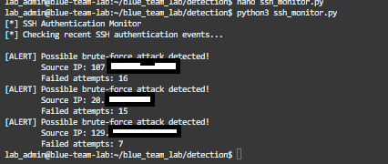
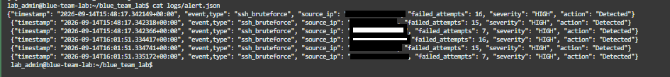
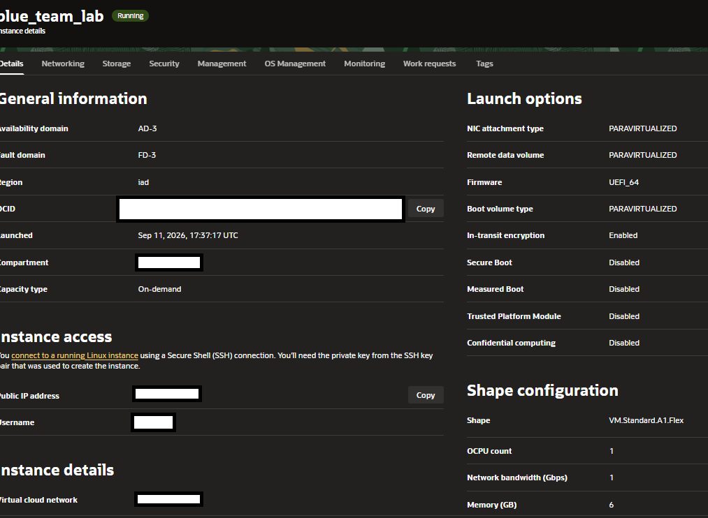

# SSH Login Attempt Detection

## Overview

As part of my **Blue Team Automation & Detection Lab**, I built a Linux-based security monitoring environment designed to detect and investigate suspicious SSH authentication activity.

The goal of this phase was to answer a simple question:

> **Can I automatically identify suspicious SSH login attempts and turn raw authentication logs into useful security alerts?**

Rather than manually reviewing authentication logs, I developed a Python-based monitoring script, `ssh_monitor.py`, that could analyze SSH authentication activity and identify failed login attempts.

The development process also provided an opportunity to troubleshoot a real issue involving Linux file permissions and understand how permissions can affect security monitoring tools.

Eventually, the lab began receiving **unauthenticated SSH traffic from external sources**, allowing the detection system to be tested against activity that was not generated by me.

---

# Lab Environment

The monitoring environment was deployed on an Oracle Cloud Linux instance.

### Components

| Component                         | Purpose                        |
| --------------------------------- | ------------------------------ |
| Oracle Cloud instance             | Linux monitoring server        |
| OpenSSH                           | Service being monitored        |
| Authentication logs               | Source of SSH telemetry        |
| `ssh_monitor.py`                  | Detection script               |
| `alerts.json`                     | Structured alert storage       |
| Debug version of `ssh_monitor.py` | Troubleshooting and validation |

The overall architecture was intentionally simple so that I could focus on understanding the detection process before introducing more complex security tooling.

### Lab Architecture

```text
                 Internet
                    |
                    v
            +---------------+
            | Oracle Cloud  |
            | Linux Server  |
            +---------------+
                    |
                    v
               OpenSSH
                    |
                    v
          Authentication Logs
                    |
                    v
             ssh_monitor.py
                    |
                    v
              alerts.json
```

---

# Building the SSH Detection Script

The first step was creating the initial `ssh_monitor.py` script.

The purpose of the script was to read SSH authentication activity and identify failed login attempts.

The detection logic was intentionally straightforward:

```text
SSH authentication event
          |
          v
    Read log entry
          |
          v
 Is authentication failed?
       /       \
     Yes        No
      |          |
      v          v
Extract data   Ignore
      |
      v
Generate alert
```

The script was designed to extract useful information such as:

* Timestamp
* Source IP address
* Attempted username
* Authentication result
* Relevant SSH event information

The initial focus was not on building a complicated detection engine. Instead, I wanted to establish a working foundation that could later be expanded with thresholds, correlation, enrichment, and automated response.

---

# Validating the Initial Script

Before troubleshooting the detection itself, I first needed to make sure that the Python script was syntactically correct and capable of running.

I executed the original `ssh_monitor.py` and confirmed that the script would launch successfully.

This was an important first checkpoint because it separated **syntax/programming problems** from **runtime/environment problems**.

### Screenshot — Original `ssh_monitor.py`



*Initial execution of **`ssh_monitor.py`**, confirming that the script was syntactically valid and could successfully run on the Linux instance.*

At this point, the script itself was running, but I was not receiving the expected detection output.

That led to the next stage of troubleshooting.

---

# The Problem: No Detection Output

Although the original script was able to run, it was not producing the expected output from the SSH authentication logs.

Initially, this raised several possibilities:

* The script might not be reading the correct log file.
* The log format might not match the detection logic.
* The SSH events might not contain the expected strings.
* The script might be failing silently.
* The script might not have permission to read the authentication log.

Instead of immediately changing the detection logic, I decided to troubleshoot the problem systematically.

This is an important part of the development process because a detection rule is only useful if the monitoring process can actually access its telemetry source.

---

# Creating a Debug Version

To determine where the problem was occurring, I created a debug version of the monitoring script.

The debug version was designed to provide additional information about what the script was doing internally.

Instead of simply waiting for an alert, I could use the debug output to determine whether the script was:

1. Starting successfully.
2. Attempting to access the authentication log.
3. Successfully reading the log.
4. Finding SSH-related events.
5. Matching the expected authentication patterns.
6. Generating an alert.

This allowed me to narrow down the problem instead of blindly modifying the detection logic.

### Screenshot — Debug Version

> **[SCREENSHOT: Debug version of ****`ssh_monitor.py`**** showing troubleshooting output]**


*Debug version of **`ssh_monitor.py`** used to determine why the original monitoring script was not producing authentication events.*

---

# Identifying the Permissions Problem

The debug process revealed that the issue was not primarily with the Python syntax or the detection logic.

The problem was related to **permissions on the authentication log file**.

The original log file was protected by Linux permissions that prevented the monitoring script from accessing the information it needed.

This is an important lesson when developing host-based security monitoring tools:

> **A detection script can be logically correct and still fail if it cannot access the telemetry it depends on.**

The investigation therefore shifted from debugging Python to understanding Linux file permissions.

After determining what access the monitoring process required, I adjusted the permissions appropriately so that the script could access the relevant authentication log.

This allowed the monitoring process to begin reading the SSH authentication events as intended.

---

# Detection Working

Once the permissions issue was resolved, the original monitoring workflow could successfully access the SSH authentication data.

The detection process could now identify failed authentication attempts and generate alerts based on the events it observed.

### Screenshot — `ssh_monitor.py` Detection Output

> **[SCREENSHOT: Terminal showing the working output from ****`ssh_monitor.py`****]**


*`ssh_monitor.py`** successfully detecting SSH authentication activity after resolving the log-access permissions issue.*

This was an important milestone because it confirmed that the problem was environmental rather than a fundamental issue with the detection logic.

---

# Structured Alert Output

To make the detection data easier to work with, alerts were also stored in `alerts.json`.

Using JSON provided a structured format that could later be consumed by other automation, monitoring tools, dashboards, or incident-response workflows.

Conceptually, the workflow became:

```text
Authentication Log
       |
       v
 ssh_monitor.py
       |
       v
 Detection
       |
       v
 alerts.json
       |
       v
 Future Automation / SIEM
```

### Screenshot — `alerts.json`

> **[SCREENSHOT: ****`alerts.json`**** containing generated SSH alerts]**



*Structured JSON output containing SSH authentication detections generated by the monitoring script.*

Storing alerts in a structured format also creates opportunities for future development, such as:

* Alert severity
* Source IP enrichment
* Attempt counters
* Geographic information
* MITRE ATT&CK mappings
* Automated notifications
* Incident correlation

---

# Oracle Cloud Instance

The monitoring environment itself was hosted on an Oracle Cloud instance.

The instance provided the Linux environment where OpenSSH, the authentication logs, and the detection scripts were running.

### Screenshot — Oracle Cloud Instance

> **[SCREENSHOT: Oracle Cloud instance showing the lab server]**


**Suggested caption:**

*Oracle Cloud instance hosting the Linux SSH monitoring environment.*

The cloud deployment also made it possible to observe unsolicited traffic against an internet-accessible SSH service.

---

# Observing External SSH Activity

After the monitoring environment was running, the server began receiving **unauthenticated SSH traffic from external sources**.

This provided an opportunity to test the detection workflow against activity that I had not manually generated.

The environment was now observing a workflow similar to:

```text
External Source
      |
      v
   Internet
      |
      v
   SSH Service
      |
      v
Authentication Log
      |
      v
 ssh_monitor.py
      |
      v
   Detection
      |
      v
 alerts.json
```

This was particularly useful because it demonstrated the difference between a controlled test and activity occurring naturally against an internet-facing service.

---

# Why Failed SSH Attempts Matter

A single failed SSH login does not automatically indicate malicious activity.

Users can mistype passwords, enter an incorrect username, or otherwise fail authentication for legitimate reasons.

However, repeated authentication failures can become a valuable indicator of suspicious activity.

For example:

```text
Source IP
   |
   +--> Failed login
   |
   +--> Failed login
   |
   +--> Failed login
   |
   +--> Failed login
   |
   +--> Failed login
```

A pattern like this may indicate:

* Brute-force activity
* Password spraying
* Automated scanning
* Unauthorized access attempts

The detection system therefore provides the telemetry necessary for further investigation rather than automatically assuming that every failed authentication is malicious.

---

# Troubleshooting Lessons

One of the most valuable parts of this phase of the project was the troubleshooting process.

The original assumption was that the lack of output could be caused by the detection logic.

However, creating a debug version of the script allowed me to narrow down the problem and determine that the underlying issue was **Linux file permissions**.

The troubleshooting process followed this general path:

```text
Write detection script
        |
        v
Verify syntax
        |
        v
Run script
        |
        v
No expected output
        |
        v
Create debug version
        |
        v
Investigate execution
        |
        v
Check log access
        |
        v
Identify permissions issue
        |
        v
Correct log access
        |
        v
Detection begins working
```

This reinforced an important principle in security engineering:

> **When a detection isn't producing results, troubleshoot the entire data pipeline—not just the detection rule.**

The pipeline includes:

```text
Telemetry
   ↓
File permissions
   ↓
Log collection
   ↓
Parsing
   ↓
Detection logic
   ↓
Alert generation
   ↓
Alert storage
```

A problem anywhere in that chain can prevent the final detection from working.

---

# Lessons Learned

### 1. Verify the basics first

Before troubleshooting complicated detection logic, I verified that the script itself could execute successfully.

This helped rule out syntax and basic Python execution problems.

### 2. Debugging is part of detection engineering

Creating a debug version of the script made it much easier to understand what was happening internally.

Rather than guessing, I could use additional output to identify where the process was failing.

### 3. Linux permissions matter

Security monitoring tools need access to the telemetry they are designed to analyze.

The original monitoring script could not produce useful detections because it did not have the necessary access to the authentication log.

Understanding Linux permissions was therefore just as important as writing the Python detection logic.

### 4. Structured alerts make future automation easier

Writing detections to `alerts.json` established a structured output that can eventually be consumed by additional automation.

### 5. Real traffic provides valuable validation

Receiving unsolicited SSH authentication attempts allowed the lab to move beyond purely simulated testing.

It demonstrated that an exposed service can receive authentication activity from external sources and that monitoring needs to operate continuously.

---

# Future Improvements

The current SSH detection provides the foundation for more advanced automation.

Planned improvements include:

### Detection

* Add thresholds for repeated failed logins.
* Track authentication attempts by source IP.
* Detect attacks targeting multiple usernames.
* Detect successful authentication following repeated failures.
* Add time-based correlation.
* Assign alert severity.

### Enrichment

* Automatically enrich suspicious IP addresses.
* Add geolocation information.
* Identify known malicious infrastructure.
* Map detections to MITRE ATT&CK techniques.

### Alerting

* Send notifications when thresholds are exceeded.
* Integrate with a SIEM.
* Create dashboards for SSH activity.
* Track incidents over time.

### Automated Response

Eventually, the project could move toward automated response actions such as temporarily blocking highly suspicious sources.

Any automated blocking would need to be implemented carefully to reduce the possibility of false positives locking out legitimate users.

---


# Conclusion

The SSH monitoring phase of the **Blue Team Automation & Detection Lab** represents the completion of **Phase 1** of a much larger security monitoring and automation project.

During this phase, I built the initial infrastructure, developed the `ssh_monitor.py` detection script, validated its syntax and execution, troubleshot a log-access permissions issue, implemented structured alert storage through `alerts.json`, and validated the detection against both controlled testing and unsolicited SSH traffic.

More importantly, this phase established the foundation that the rest of the project will build upon.

The project is **not considered complete** with the SSH detection currently implemented. The goal is to continue developing the lab into a more complete blue-team security monitoring and automated response platform.

## Project Status

| Phase                                            | Status             | Description                                                                                                |
| ------------------------------------------------ | ------------------ | ---------------------------------------------------------------------------------------------------------- |
| **Phase 1 — Infrastructure & Initial Detection** | ✅ **COMPLETE**     | Build the Linux monitoring environment and implement the initial SSH authentication detection.             |
| **Phase 2 — Alerting & Severity**                | 🔄 **IN PROGRESS** | Develop alert severity levels, thresholds, correlation, and improved notification capabilities.            |
| **Phase 3 — Automated Response**                 | 📋 **PLANNED**     | Introduce controlled automated response actions for validated suspicious activity.                         |
| **Phase 4 — Dashboard & Investigation**          | 📋 **PLANNED**     | Build a centralized view for monitoring events, investigating alerts, and analyzing attack activity.       |
| **Phase 5 — Documentation & Detection Testing**  | 📋 **PLANNED**     | Conduct structured detection testing, document results, identify gaps, and improve the detection pipeline. |

### Where the Project Goes Next

The next stage will focus on moving beyond simply **detecting** SSH authentication activity.

The project will progressively evolve from:

```text
Phase 1
Infrastructure
      ↓
Initial Detection
      ↓
Phase 2
Alerting & Severity
      ↓
Phase 3
Automated Response
      ↓
Phase 4
Dashboard & Investigation
      ↓
Phase 5
Detection Testing & Documentation
```

The long-term objective is to develop a small but functional **Blue Team/SOC-style detection and response environment** that demonstrates the complete lifecycle of security monitoring:

```text
Collect
   ↓
Detect
   ↓
Alert
   ↓
Prioritize
   ↓
Investigate
   ↓
Respond
   ↓
Document
   ↓
Test & Improve
```

Therefore, the SSH monitoring system documented here should be viewed as the **foundation of the project rather than the finished product**.

**Phase 1 is complete, but the lab is still actively being developed.** The upcoming phases will build on the infrastructure and detection capabilities established here to introduce more advanced alerting, automation, investigation, visualization, and detection engineering.

The goal is ultimately to demonstrate not just that I can write a security detection, but that I can build, troubleshoot, test, monitor, and continuously improve an end-to-end defensive security workflow.

