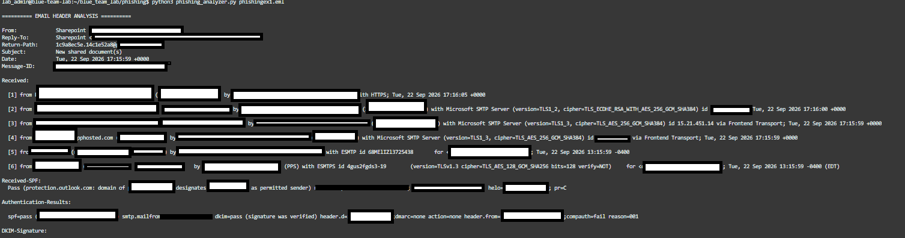

# Phishing Email Analyzer

## Phase 1 — Email Ingestion & Parsing

### Project Overview

This project is a Python-based **Phishing Email Analyzer** being developed from the perspective of a Security Operations Center (SOC) analyst.

The long-term objective is to build a workflow that can take a suspicious email, extract relevant evidence, analyze that evidence, identify potentially malicious indicators, and produce an analyst-oriented assessment.

The project is being developed incrementally through multiple phases. Each phase adds another layer of functionality to the investigation workflow.

**Phase 1 establishes the email evidence-acquisition and parsing layer.**

---

## Phase 1 Objective

The objective of Phase 1 was to establish a reliable method for taking an `.eml` file and converting it into information that can be programmatically analyzed.

The initial workflow is:

**`.eml file → Email parser → Structured email data`**

Rather than manually copying individual headers or email fields into a script, the analyzer uses the `.eml` file as the investigation input.

This provides a repeatable starting point for subsequent analysis.

---

## Why `.eml`?

An email client may display only a limited amount of information to the end user.

An `.eml` file can contain significantly more information that may be useful during an investigation, including:

* Sender information
* Recipient information
* Subject
* Reply-To
* Return-Path
* Message-ID
* Received headers
* Authentication-related headers
* Message body
* MIME structure
* Attachments

From an SOC perspective, preserving and analyzing this information is important because suspicious email investigations often depend on details that aren't immediately visible in the normal email interface.

---

## What I Implemented

During Phase 1, I established the initial email ingestion and parsing functionality.

The analyzer can:

* Accept an `.eml` file as the investigation input.
* Programmatically parse the email.
* Access email header information.
* Access the message body.
* Access the MIME structure of the message.
* Identify email components that can be analyzed during later phases.
* Use real email samples as controlled test data.

The resulting foundation allows the project to move beyond manually inspecting an email and toward a repeatable analysis workflow.

---

## Testing Methodology

For testing, I used a **simulated phishing email as a controlled test sample**.

The sample was known to be part of a phishing simulation, allowing it to function as a known-label test case.

This distinction is important.

The purpose of Phase 1 was **not** to claim that the analyzer independently identified the email as phishing.

Instead, the known classification provided a controlled sample that could be used to verify that the analyzer was capable of successfully ingesting and exposing the information contained within a realistic phishing email.

The testing approach can therefore be represented as:

**Known test sample → Validate ingestion and parsing**

rather than:

**Known phishing sample → Assume detection capability**

This separation between **evidence collection** and **evidence interpretation** will remain important as the project develops.

---

## SOC Analyst Perspective

A key design principle of this project is to separate raw evidence from analytical conclusions.

For example, during Phase 1, the analyzer may extract a `Received` header containing information about the systems involved in delivering the email.

At this stage, the analyzer should record that information accurately.

It should not automatically conclude:

> "This email is malicious."

That determination requires additional context and analysis.

Later phases will examine the extracted evidence for indicators such as:

* Authentication failures
* Sender and domain inconsistencies
* Suspicious routing
* Suspicious URLs
* Lookalike domains
* Malicious attachments
* Threat-intelligence matches
* Other phishing indicators

The overall goal is to build toward a process where individual observations can be correlated into a defensible analyst assessment.

---

## Phase 1 Architecture

The architecture established during this phase is intentionally simple:

```text
              .EML FILE
                  │
                  ▼
        ┌──────────────────┐
        │  EMAIL PARSER    │
        └────────┬─────────┘
                 │
                 ▼
       ┌─────────────────────┐
       │ STRUCTURED EMAIL    │
       │ DATA                │
       ├─────────────────────┤
       │ Headers             │
       │ Body                │
       │ MIME Parts          │
       │ Attachments         │
       │ Metadata            │
       └──────────┬──────────┘
                  │
                  ▼
          FUTURE ANALYSIS
```

This architecture provides a clean separation between **ingestion** and the analysis components that will be added in subsequent phases.

---
Phase 1 Output

The following screenshot shows an example of the analyzer's output after successfully processing an .eml file.

Note: The screenshot has been heavily redacted. Sensitive email information, identifying details, and other potentially confidential data have been removed for privacy and security purposes. The redactions do not represent missing functionality in the analyzer.



Figure 1 — Redacted example of the Phishing Email Analyzer successfully processing an .eml sample and displaying extracted email information.

The purpose of this screenshot is to demonstrate the successful execution of the Phase 1 ingestion and parsing workflow while avoiding the disclosure of information contained within the test email.

The output demonstrates the transition from:

.eml file → Parsed email → Extracted email information

This output will serve as the foundation for the analysis performed in subsequent phases.

## Lessons Learned

One of the primary lessons from Phase 1 was the importance of treating the original email as an evidence source rather than relying exclusively on the information presented by an email client.

Another important lesson was the distinction between **collecting evidence and interpreting evidence**.

A parser should accurately extract and preserve information before detection logic attempts to determine what that information means.

This approach also helps reduce the risk of treating a single indicator as definitive evidence of malicious activity.

A suspicious header, authentication failure, or unusual domain may warrant investigation, but the significance of that indicator depends on the broader context.

---

## Phase 1 Result

Phase 1 successfully established the initial evidence pipeline for the Phishing Email Analyzer.

The project can now move from an `.eml` file to structured email information that can be consumed by future analysis components.

The completed foundation is:

**`.eml → Parser → Structured Email Data`**

This provides the starting point for deeper investigation of the email's headers, authentication information, URLs, attachments, and other indicators.

---

## Next Phase

### Phase 2 — Email Header Analysis

The next phase will move from **email ingestion** into **evidence analysis**.

The focus will be on examining the headers extracted during Phase 1, including:

* `Received` headers
* Sender-related headers
* Reply-To
* Return-Path
* Message-ID
* Mail-routing information
* Other relevant header relationships

The goal is to begin reconstructing the email's delivery path and identifying inconsistencies or anomalies that may be relevant during an SOC investigation.

**Phase 1: Complete ✅**

**Phase 2: Header Analysis → Next**

